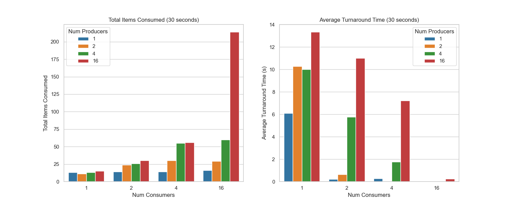

# Producer-Consumer Problem: C++ Implementation with Pthreads and Semaphores

## Overview

This project implements the classic producer-consumer problem in C++, showcasing the use of pthreads for thread management and semaphores for synchronization. The producer threads generate random integers and insert them into a bounded buffer, while consumer threads remove those integers and "consume" them (in this case, simply printing them).

## Project Goals

1.  **Concurrency and Synchronization:** Demonstrate a thorough understanding of how to create and manage concurrent threads in C++ using pthreads.
2.  **Semaphore Usage:** Showcase proficiency in using semaphores for synchronization in a producer-consumer scenario, preventing race conditions and ensuring correct data flow.
3.  **Performance Analysis:**  Analyze the system's performance under different configurations, varying the number of producers, consumers, and program runtime.
4.  **Graceful Shutdown:** Implement a robust mechanism to gracefully terminate the program, ensuring all threads finish their work and resources are released properly.

## Implementation Details

*   **Language:** C++
*   **Threading Library:** pthreads
*   **Synchronization:** Semaphores for buffer access control, mutex for shared data protection, barrier for start/stop coordination
*   **Data Structure:** Circular buffer (`buffer_t` struct) with `head`, `tail`, and `count` to track items.
*   **Error Handling:** Includes checks for full/empty buffer conditions and signal handling for graceful termination.

## How to Build and Run

1.  **Compilation:**
    ```bash
    make
    ```

2.  **Execution:**
    ```bash
    ./producer_consumer <sleep_time> <num_producers> <num_consumers>
    ```
    *   `sleep_time`: Duration (in seconds) for which the program runs.
    *   `num_producers`: Number of producer threads.
    *   `num_consumers`: Number of consumer threads.

**Example:**

```bash
./producer_consumer 30 4 16 
```

## Project Structure

*   **`buffer.h`:** Defines the `buffer_t` structure and function prototypes for buffer operations.
*   **`buffer.cpp`:** Implements the buffer functions (`buffer_init`, `insert_item`, `remove_item`).
*   **`producer.h`:** Declares the `producer` thread function.
*   **`producer.cpp`:** Implements the `producer` thread logic.
*   **`consumer.h`:** Declares the `consumer` thread function.
*   **`consumer.cpp`:** Implements the `consumer` thread logic.
*   **`main.cpp`:**  Main program, handles command-line arguments, thread creation, synchronization, and shutdown.
*   **`globals.h`:** Declares global variables shared by threads.

## Performance Analysis




**Observations:**

*   The number of producers has a more significant impact on total items produced and consumed than the number of consumers.
*   Increasing the number of consumers reduces average turnaround time up to a point, after which it plateaus due to producer limitations.
*   Doubling the sleep time roughly doubles the number of items produced and consumed, with a minor impact on average turnaround time.

## Future Improvements

*   Dynamic buffer size configuration for more flexible experimentation.
*   Implementation of alternative synchronization mechanisms (e.g., condition variables) for comparison.